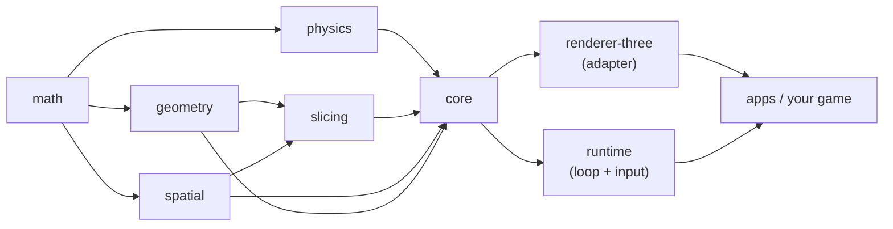

# Vanilla Slice


A reusable, **framework-agnostic** and **renderer-agnostic** TypeScript engine for
real-time **physics**, **mesh slicing** (Fruit Ninja–style), **geometry
processing**, and **spatial queries**.

Vanilla Slice is **not a game** — it's the engine underneath one. Games, demos,
and other apps are *consumers* of the engine.

- **Headless core** — no DOM, no browser APIs, no rendering, no framework. Runs
  anywhere JavaScript runs.
- **Rendering is an adapter** — Three.js is the first adapter, never a
  requirement. The engine owns simulation state; renderers only read it.
- **Composable packages** — a small, strongly-typed public API you can adopt
  piece by piece, published under the `@vanilla-slice/*` scope.

```ts
import { createWorld, createBox } from '@vanilla-slice/core';

const world = createWorld({ gravity: [0, -9.81, 0] });

world.spawn({ geometry: createBox(1, 1, 1), position: [0, 5, 0], mass: 1 });

// Drive the fixed-timestep simulation from your own loop.
world.update(1 / 60);
```

## Features

- **Rigid-body physics** — fixed-timestep, symplectic integration, gravity,
  linear/angular damping, and bounds cleanup.
- **Collisions on generalised meshes** — convex-hull colliders with GJK + EPA
  narrow-phase, face-clipping contact manifolds, and a sequential-impulse solver
  (restitution + Coulomb friction, linear *and* angular response). Immovable
  bodies via infinite mass; optional approximate convex decomposition for
  concave shapes.
- **Bounded mesh slicing** — a slice is a *bounded interaction volume*, never an
  infinite plane. Pluggable regions: **sphere**, **cylinder**, **box**, or
  **unbounded**. Produces closed fragments with separation impulses.
- **Spatial broad-phase** — a uniform spatial hash for region/neighbour/pair
  queries; avoids O(n²) scans.
- **Zero-dependency math** — vectors, matrices, and quaternions.
- **Deterministic-where-feasible**, minimal per-frame allocations, scalable to
  hundreds of objects.

## Architecture

Dependencies flow **one way**: consumers depend on adapters/runtime, which
depend on the framework-free core.



### Golden rules

1. No framework (Angular/React/…) in the core.
2. No Three.js in `physics`/`geometry`/`slicing`/`spatial`/`math`/`core`.
3. No DOM or browser APIs in the engine — it must run headless.
4. No circular dependencies between packages.
5. Rendering is an adapter; it reads engine state, never owns simulation state.
6. The update loop is engine-driven and imperative — a framework never controls it.

## Packages

| Package | Description | Depends on |
| --- | --- | --- |
| [`@vanilla-slice/math`](packages/math) | Vectors, matrices, quaternions. | — |
| [`@vanilla-slice/geometry`](packages/geometry) | Mesh representation, plane intersection, convex hulls, mesh splitting, convex decomposition. | `math` |
| [`@vanilla-slice/physics`](packages/physics) | Rigid bodies, integration, collisions (GJK/EPA), impulse solver. | `math` |
| [`@vanilla-slice/spatial`](packages/spatial) | Spatial hash / broad-phase queries. | `math` |
| [`@vanilla-slice/slicing`](packages/slicing) | Bounded slice volumes, candidate filtering, fragment generation. | `geometry`, `spatial`, `math` |
| [`@vanilla-slice/core`](packages/core) | ECS world orchestrating the above — the main entry point. | core packages |
| [`@vanilla-slice/renderer-three`](packages/renderer-three) | Three.js rendering adapter + raycasting. | `core`, `math`, `three` (peer) |
| [`@vanilla-slice/runtime`](packages/runtime) | Framework-agnostic engine loop + swipe-to-slice input. | `core`, `math` |

Most apps only need to depend on `@vanilla-slice/core` (which re-exports a
curated facade), plus `renderer-three` and `runtime` if you want the batteries
included.

## Installation

```bash
npm install @vanilla-slice/core @vanilla-slice/renderer-three @vanilla-slice/runtime three
```

`three` is a **peer dependency** of `renderer-three`, so you control its version.
The packages ship as ESM with type declarations and require **Node ≥ 18**.

## Usage

### Headless simulation

```ts
import { createWorld, createBox } from '@vanilla-slice/core';

const world = createWorld({
  gravity: [0, -9.81, 0],
  collisions: true, // on by default
  restitution: 0.2,
  friction: 0.5,
});

// A dynamic box…
world.spawn({ geometry: createBox(1, 1, 1), position: [0, 5, 0], mass: 1 });
// …resting on an immovable one (infinite mass).
world.spawn({ geometry: createBox(10, 1, 10), position: [0, 0, 0], mass: 0 });

// Advance with a variable frame delta; physics steps at a fixed timestep.
world.update(1 / 60);

// Snapshot transforms for your renderer to consume.
const state = world.getRenderState();
```

### Slicing

A slice is a cutting **plane** confined to a bounded **region**:

```ts
import {
  createPlane,
  fromNormalAndPoint,
  sliceVolume,
  cylinderRegion,
} from '@vanilla-slice/core';

const plane = fromNormalAndPoint(createPlane(), [0, 1, 0], [0, 0, 0]);
// A cylinder along the camera axis cuts objects at any depth along the swipe.
const volume = sliceVolume(plane, cylinderRegion([0, 0, 0], [0, 0, 1], 1.5));

const { removed, created } = world.slice(volume);
```

### With Three.js + the runtime loop

```ts
import { createWorld, createBox } from '@vanilla-slice/core';
import { ThreeRenderer } from '@vanilla-slice/renderer-three';
import { EngineLoop } from '@vanilla-slice/runtime';
import { Scene, PerspectiveCamera, WebGLRenderer, MeshStandardMaterial } from 'three';

const world = createWorld({ gravity: [0, -9.81, 0] });
world.spawn({ geometry: createBox(1, 1, 1), meshRef: 'crate', position: [0, 3, 0] });

const scene = new Scene();
const camera = new PerspectiveCamera(55, 1, 0.1, 100);
const gl = new WebGLRenderer();
const renderer = new ThreeRenderer({
  scene,
  createMaterial: () => new MeshStandardMaterial({ color: 0x40c4ff }),
});

const loop = new EngineLoop((dt) => {
  world.update(dt);
  renderer.sync(world);
  gl.render(scene, camera);
});
loop.start();
```

## Demos

Two showcase apps live in [`apps/`](apps) and consume the engine like any other
app (they own their own imperative loop):

```bash
npx nx serve @vanilla-slice/slicing-game     # http://localhost:5173
npx nx serve @vanilla-slice/spinning-slices  # http://localhost:5174
```

Production bundles:

```bash
npx nx bundle @vanilla-slice/slicing-game    # -> apps/slicing-game/dist-web
npx nx preview @vanilla-slice/slicing-game
```

## Development

This is an [Nx](https://nx.dev) monorepo using npm workspaces.

```bash
npm install                     # install everything
npx nx run-many -t build        # build all packages
npx nx run-many -t test         # run all tests (Vitest)
npx nx run-many -t lint         # lint + enforce module boundaries
npx nx graph                    # visualise the dependency graph
```

Dependency-boundary rules (enforced by ESLint) keep the layering honest — e.g.
`physics` can only depend on `math`, and nothing may import a rendering adapter
into the core.

## Releasing

Releases are automated with `nx release` and **Conventional Commits**. On a push
to `master`, the version is computed from commit messages (`fix:` → patch,
`feat:` → minor), the changelog and tag are generated, and the packages are
published to npm. While the engine is `0.x`, treat breaking changes as `feat:`
(minor) — see [ADR 0008](docs/adr/0008-versioning-and-publishing.md).

## Documentation

- [Architecture](docs/ARCHITECTURE.md)
- [Principles](docs/PRINCIPLES.md)
- [Specification](docs/SPEC.md)
- [Roadmap](docs/ROADMAP.md)
- [Architecture Decision Records](docs/adr)

## License

[MIT](LICENSE) © Rohan Fredriksson
