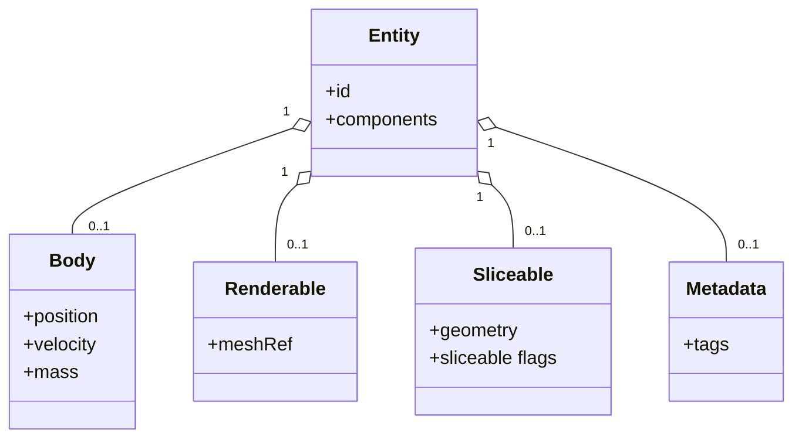
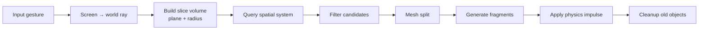
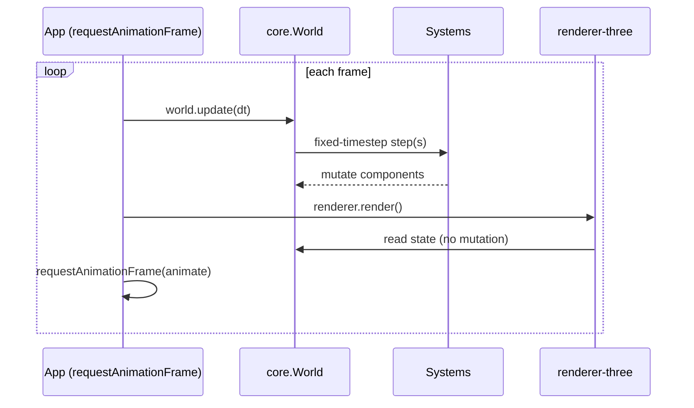

# Vanilla Slice — Architecture (ARCHITECTURE.md)

Status: Draft · Phase: Pre-implementation

This document describes the structural and runtime architecture of Vanilla Slice:
the layers, the package dependency graph, the ECS model, the slice pipeline, and
the runtime loop.

## 1. Layered architecture

Three layers with a strict one-way dependency direction. Higher layers depend on
lower layers; lower layers never depend on higher ones.

```mermaid
flowchart TD
    subgraph CONS["Consumers"]
        APPS[apps: slicing-game, spinning-slices]
        EXT[external framework integrations<br/>(Angular, React, … — own repos)]
    end
    subgraph RT["Runtime (framework-agnostic)"]
        RUN[runtime: engine loop + swipe input]
    end
    subgraph RA["Rendering Adapters"]
        R3[renderer-three: meshes, transforms, raycasting]
    end
    subgraph CE["Core Engine (framework-free, headless)"]
        CORE[core: ECS world]
        SLICE[slicing]
        PHYS[physics]
        GEO[geometry]
        SPAT[spatial]
        MATH[math]
    end

    APPS --> R3
    APPS --> RUN
    APPS --> CORE
    EXT --> R3
    EXT --> RUN
    EXT --> CORE
    RUN --> CORE
    RUN --> MATH
    R3 --> CORE
    R3 --> MATH
    CORE --> PHYS
    CORE --> SLICE
    CORE --> SPAT
    CORE --> GEO
    SLICE --> GEO
    SLICE --> SPAT
    SLICE --> MATH
    PHYS --> MATH
    GEO --> MATH
    SPAT --> MATH
```

Rules encoded above:
- `math` depends on nothing.
- `geometry`, `physics`, `spatial` depend only on `math`.
- `slicing` depends on `geometry`, `spatial`, `math`.
- `core` orchestrates core packages; it does not depend on adapters.
- `renderer-three` depends on `core` + `math` (+ Three.js), never the reverse.
- `runtime` depends on `core` + `math`, never the reverse.
- Framework integrations live in their own repositories (ADR 0006) and consume
  the published engine; no framework package ships in this monorepo.

## 2. Package dependency graph

```
math        → (none)
geometry    → math
physics     → math
spatial     → math
slicing     → geometry, spatial, math
core        → physics, slicing, spatial, geometry, math
renderer-three → core, math, three
runtime     → core, math
```

No circular dependencies are permitted. To break a would-be cycle, introduce a
new package or invert the dependency; never create a loop.

> **Framework integrations** (Angular, React, …) live in their own repositories
> (ADR 0006), consuming the published engine + `runtime`. A reference Angular
> host is kept at `docs/examples/angular/` (not built or tested).

## 3. Entity-Component-System (light ECS)

The engine uses composition, not inheritance. Entities are ids with attached
components; systems operate on components.



### Systems
- **PhysicsSystem** — gravity, integration, rigid bodies, collision.
- **SpatialSystem** — maintains broad-phase structure; answers region queries.
- **SliceSystem** — builds slice volumes, filters candidates, splits meshes.
- **RenderSystem** — bridges engine state to the rendering adapter.
- **CleanupSystem** — removes out-of-bounds/expired entities.

Systems read/write components; they do not subclass entities.

## 4. Slice pipeline

A slice is a bounded interaction volume (plane + radius), never an infinite
plane.



## 5. Runtime loop

The loop is imperative and engine-driven. Angular (or any framework) must not
control or gate it.



Target loop shape:

```ts
function animate() {
  world.update(dt);
  renderer.render();
  requestAnimationFrame(animate);
}
```

Physics advances on a **fixed timestep** internally, decoupled from the variable
frame delta, for determinism and stability.

## 6. Ownership boundaries

| Concern            | Owner            |
| ------------------ | ---------------- |
| position, velocity | physics          |
| mesh data          | geometry         |
| meshes (GPU)       | renderer adapter |
| score, UI, effects | app/game         |
| simulation state   | engine (core)    |

## 7. Data flow summary

Input → core (systems mutate components) → renderer adapter reads state →
frame presented. State flows one way into the renderer; the renderer never
writes back into simulation ownership data.

## 8. Extensibility

- New renderers are added as sibling adapters to `renderer-three` depending only
  on `core` + `math`.
- New framework integrations live in their own repositories, consuming the
  published engine + `runtime` (ADR 0006).
- New simulation behavior is added as new systems/components in core packages,
  preserving boundaries and the one-way dependency direction.
