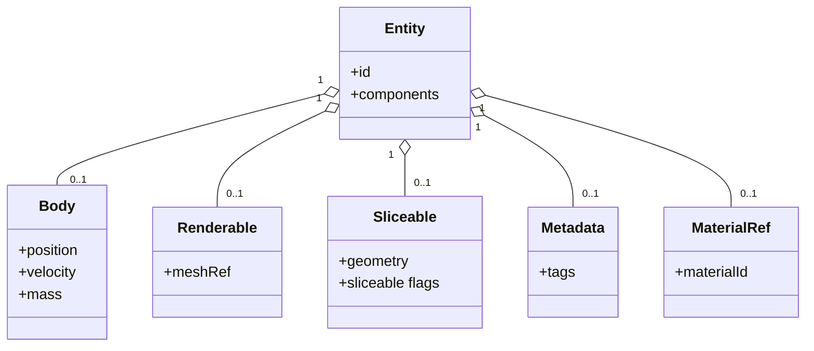
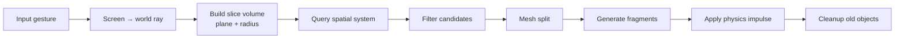
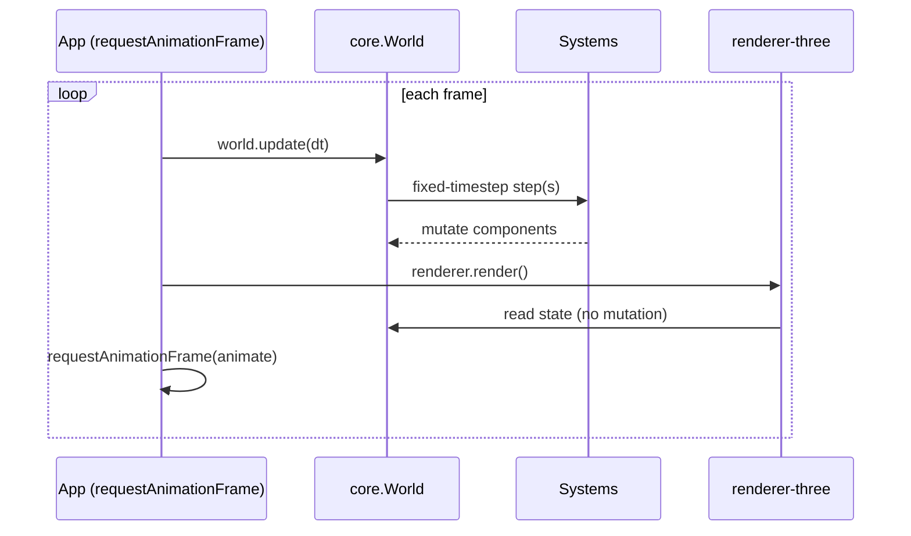
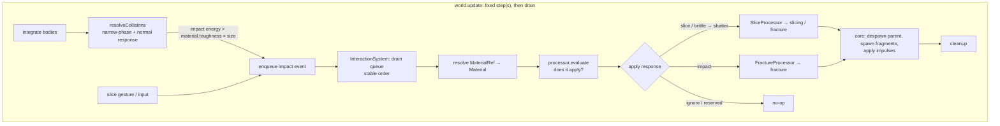

# Vanilla Slice — Architecture (ARCHITECTURE.md)

Status: Living · Core engine, slicing, rendering, runtime, materials, the
interaction framework, and fracture are implemented (ADRs 0001–0009).

This document describes the structural and runtime architecture of Vanilla Slice:
the layers, the package dependency graph, the ECS model, the slice pipeline, the
materials/interaction/fracture model, and the runtime loop.

## 1. Layered architecture

Three layers with a strict one-way dependency direction. Higher layers depend on
lower layers; lower layers never depend on higher ones.

```mermaid
flowchart TD
    subgraph CONS["Consumers"]
        APPS[apps: slicing-game, spinning-slices]
        EXT[external framework integrations<br/>(Angular, React, … — own repos)]
    end
    subgraph RT["Runtime (framework-agnostic)"]
        RUN[runtime: engine loop + swipe input]
    end
    subgraph RA["Rendering Adapters"]
        R3[renderer-three: meshes, transforms, raycasting]
    end
    subgraph CE["Core Engine (framework-free, headless)"]
        CORE[core: ECS world + interaction system]
        INT[interactions]
        MAT[materials]
        SLICE[slicing]
        FRAC[fracture]
        PHYS[physics]
        GEO[geometry]
        SPAT[spatial]
        MATH[math]
    end

    APPS --> R3
    APPS --> RUN
    APPS --> CORE
    EXT --> R3
    EXT --> RUN
    EXT --> CORE
    RUN --> CORE
    RUN --> MATH
    R3 --> CORE
    R3 --> MATH
    CORE --> INT
    CORE --> MAT
    CORE --> PHYS
    CORE --> SLICE
    CORE --> FRAC
    CORE --> SPAT
    CORE --> GEO
    INT --> MAT
    INT --> PHYS
    SLICE --> GEO
    SLICE --> SPAT
    SLICE --> MATH
    FRAC --> GEO
    PHYS --> MATH
    GEO --> MATH
    SPAT --> MATH
```

Rules encoded above:
- `math` depends on nothing.
- `materials` depends on nothing (a pure-data leaf, like `math`).
- `geometry`, `physics`, `spatial` depend only on `math`.
- `slicing` depends on `geometry`, `spatial`, `math`.
- `fracture` depends on `geometry`, `spatial`, `math` (sibling of `slicing`).
- `interactions` (the interaction framework) depends on `materials`, `physics`,
  `geometry`, `spatial`, `math`; never on `core`, `slicing`, or `fracture`.
- `core` orchestrates the core packages (now including `interactions`,
  `materials`, `fracture`); it does not depend on adapters.
- `renderer-three` depends on `core` + `math` (+ Three.js), never the reverse.
- `runtime` depends on `core` + `math`, never the reverse.
- Framework integrations live in their own repositories (ADR 0006) and consume
  the published engine; no framework package ships in this monorepo.

## 2. Package dependency graph

```
math         → (none)
materials    → (none)
geometry     → math
physics      → math
spatial      → math
slicing      → geometry, spatial, math
fracture     → geometry, spatial, math
interactions → materials, physics, geometry, spatial, math
core         → interactions, materials, fracture, slicing, physics, spatial, geometry, math
renderer-three → core, math, three
runtime      → core, math
```

No circular dependencies are permitted. To break a would-be cycle, introduce a
new package or invert the dependency; never create a loop. Nx `scope:*` and
`layer:*` tags enforce these one-way dependencies (see `eslint.config.mjs`).

> **Framework integrations** (Angular, React, …) live in their own repositories
> (ADR 0006), consuming the published engine + `runtime`. A reference Angular
> host is kept at `docs/examples/angular/` (not built or tested).

## 3. Entity-Component-System (light ECS)

The engine uses composition, not inheritance. Entities are ids with attached
components; systems operate on components.



### Systems
- **PhysicsSystem** — gravity, integration, rigid bodies.
- **CollisionSystem** — narrow-phase + contact resolution; emits `impact`
  interaction events when energy exceeds a material's fracture threshold.
- **SpatialSystem** — maintains broad-phase structure; answers region queries.
- **InteractionSystem** — drains the per-step interaction queue and dispatches
  each event to its processor (`SliceProcessor`, `FractureProcessor`, …). Slicing
  is an interaction, not a bespoke top-level system (ADR 0009).
- **RenderSystem** — bridges engine state to the rendering adapter.
- **CleanupSystem** — removes out-of-bounds/expired entities.

Systems read/write components; they do not subclass entities. Interactions are
stateless **processors** registered with the `InteractionSystem`, so new
behaviours are added without new top-level systems.

## 4. Slice pipeline (a slice interaction)

A slice is a bounded interaction volume (plane + radius), never an infinite
plane. Slicing is dispatched as a **slice interaction** through the interaction
framework (§9); the pipeline below is what its processor runs. A gesture
enqueues one `slice` event per broad-phase candidate; a brittle material shatters
via the fracture path instead of cutting cleanly.



## 5. Runtime loop

The loop is imperative and engine-driven. Angular (or any framework) must not
control or gate it.



Target loop shape:

```ts
function animate() {
  world.update(dt);
  renderer.render();
  requestAnimationFrame(animate);
}
```

Physics advances on a **fixed timestep** internally, decoupled from the variable
frame delta, for determinism and stability.

## 6. Ownership boundaries

| Concern            | Owner            |
| ------------------ | ---------------- |
| position, velocity | physics          |
| mesh data          | geometry         |
| material properties (data) | materials (referenced by `MaterialRef`) |
| interaction dispatch | core (`InteractionSystem`) |
| meshes (GPU)       | renderer adapter |
| score, UI, effects | app/game         |
| simulation state   | engine (core)    |

## 7. Data flow summary

Input → core (systems mutate components) → renderer adapter reads state →
frame presented. State flows one way into the renderer; the renderer never
writes back into simulation ownership data.

## 8. Extensibility

- New renderers are added as sibling adapters to `renderer-three` depending only
  on `core` + `math`.
- New framework integrations live in their own repositories, consuming the
  published engine + `runtime` (ADR 0006).
- New **interactions** (fracture, impact, and future deformation/explosion/
  laser/constraint-failure) are added as stateless processors registered with the
  `InteractionSystem` (ADR 0009) — no new top-level systems required.
- New simulation behavior is added as new systems/components in core packages,
  preserving boundaries and the one-way dependency direction.

---

## 9. Materials, interactions & fracture (ADR 0009)

Slicing is one of many *interactions* an object can experience. Behaviour is
**data-driven**: a `Material` decides whether an object slices, fractures, or
resists — "fruit slices, glass fractures, steel resists" follows from material
data, not object-type branching. Implemented across three core-layer packages
plus `core` orchestration (ADR 0009).

### 9.1 Responsibilities

- **`materials` (leaf).** Pure data: `Material` records (density, friction,
  restitution, toughness, brittleness, fracturePropagationFactor), a
  `MaterialLibrary` registry, and derived helpers (`massFromDensity`,
  `fractureThreshold`, `fractureFragmentCount`). No behaviour. Entities carry a
  lightweight `MaterialRef` component (a material id); the world resolves it to a
  `Material`, deriving body mass from `density × volume` and combining per-body
  restitution/friction in contacts.
- **`interactions` (framework only).** Interaction/event types
  (`InteractionType`, `InteractionEvent`, `InteractionProcessor`,
  `InteractionContext<W>`), a processor `registry`, a per-step event `queue`, and
  the material-evaluation glue (`exceedsFractureThreshold`). No concrete
  world-mutating processors — so it never depends on `core` (avoids a cycle).
- **`fracture` (sibling of `slicing`).** Pure geometry: Voronoi cell generation
  by iterative bisector clipping, optional precomputed/normalized patterns,
  propagation-controlled seed clustering (localized shatter vs cracks that spread
  across the body), and a deterministic seeded RNG → fragment meshes + radial
  impulses. Owns no world state and applies no impulses (as with `slicing`).
- **`core` (orchestration).** Owns the concrete processors — `SliceProcessor`
  and `FractureProcessor` — that adapt `slicing`/`fracture` into the framework and
  perform spawn/despawn (a shared `replaceWithFragments` helper distributes mass,
  applies impulses, and inherits the parent material). A single `InteractionSystem`
  drives the registry over the per-step queue. `sliceWorld` is retained as a thin
  shim that enqueues `slice` events.

Interaction types are **stateless processors** (not systems, plugins, or
services) sharing one pipeline: `event → resolve material → evaluate → apply`.
New interaction types (`deformation`, `explosion`, `laser`, `constraint-failure`)
are reserved for future milestones.

### 9.2 Runtime interaction flow

Detection stays in `physics`; interaction resolution runs as a distinct phase
after the physics solve, over a per-step event queue, so geometry mutation never
occurs inside the collision solver (avoids re-entrancy; preserves deterministic
ordering under the fixed timestep, ADR 0005).



Refined conceptual flow:

```
Collision → Interaction evaluation → Material evaluation → Interaction response
          → Fracture | Slice | Ignore | (future response)
```
